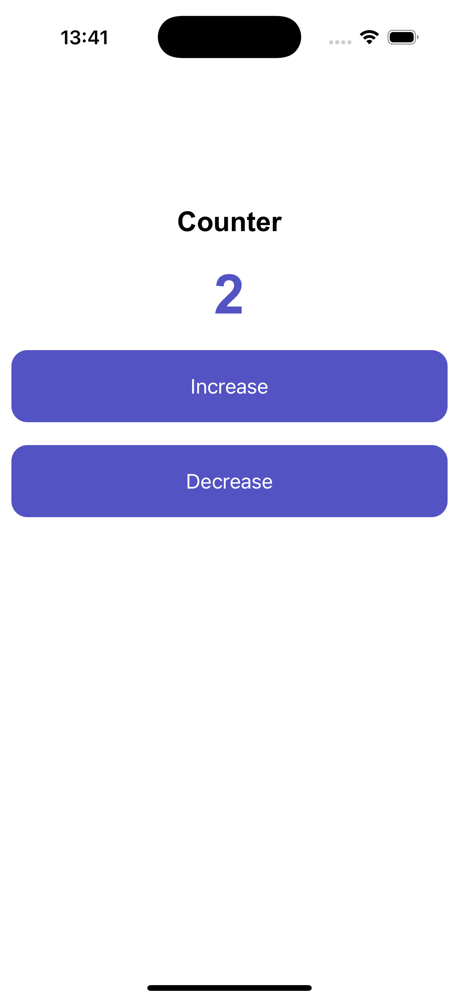

# Webview mobile app

## Steps

- Install [AndroidStudio](https://developer.android.com/studio) or/and [XCode (only for Mac)](https://developer.apple.com/xcode/)
- Install [nodejs](https://nodejs.org/en)
- Create folder speciality for project
```bash
mkdir webviewMobileApp # or your speciality name
```
```bash
cd webviewMobileApp
```
- Initialize ```npm project```
```bash
# inner webviewMobileApp
npm init
```
- Install npm packages
    - ```@capacitor/cli```
    - ```@capacitor/core```
    - ```@capacitor/android``` Windows/Mac
    - ```@capacitor/ios``` only for Mac

```bash
npm install @capacitor/cli @capacitor/core @capacitor/android @capacitor/ios
```
- Initialize ```capacitor config```
```bash
# USE NPX, IT IS IMPORTANT
npx cap init
```
- Create a folder which is set in ```capacitor.config.json``` in field ```webDir```. In this example it is - ```www```
```bash
mkdir www
```
- In ```www``` create three files ```index.html```, ```script.js``` and ```style.css```. These are three basic files needed to create a simple site and our mobile app 😎
- After creating and containg ```index.html```, ```script.js``` and ```style.css``` run these commands one by one
```bash
# for adding ios to your project
npx cap add ios # or/and android
```
```bash
# for sync ./www and ./ios project
npx cap sync ios
```
```bash
# for start/restart app
npx cap run ios
```

### Congratulations! Your mobile app is ready 🚀 🤩

## For restart updates
Run only these commands one by one
```bash
# for sync ./www and ./ios project
npx cap sync ios
```
```bash
# for start/restart app
npx cap run ios
```

### Example contains code for this mobile app
<div>
    
</div>

## Conclusion
In conclusion, building mobile applications using Capacitor and simple HTML is an efficient and effective approach. It allows developers to leverage web technologies while maintaining native functionality and performance. This method simplifies the development process, making it accessible for beginners and powerful enough for advanced users.

Happy coding! 🚀